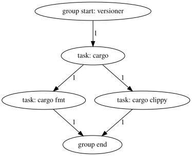

# `engage`

A task runner with DAG-based parallelism

---

## Features

* [X] Use any interpreter (typically, a shell such as `sh`)
* [X] Tasks can depend on other tasks (within the same group)
* [X] Groups can depend on other groups
* [X] Get an overview of tasks and groups by viewing them as a graph
* [ ] Run a subset of the tasks and groups
  * [ ] Run a single group
  * [ ] Run a single task from that group
* [ ] List available groups and tasks
* [ ] Shell completion

## Introduction

A simple Engage file might look like this:

```toml
shell = ["/usr/bin/env", "sh", "-c"]

[[task]]
name = "cargo"
group = "versioner"
cmd = "cargo --version"

# There's no side effect that the following tasks depend on caused by the
# previous task, but this is just an example, and you wouldn't do this for real.

[[task]]
name = "cargo fmt"
group = "versioner"
cmd = "cargo fmt --version"
depends = ["cargo"]

[[task]]
name = "cargo clippy"
group = "versioner"
cmd = "cargo clippy --version"
depends = ["cargo"]
```

This creates a *group* called "versioner"[^1] with three *tasks*: "cargo fmt"
and "cargo clippy", which depend on "cargo". This can be visualized by running
`engage self dot` and feeding the output to Graphviz:



When it's time to run a task, its command will be appended as a single element
to the `shell` list, which will then be executed.

When run with no arguments, Engage will execute the entire DAG, starting by
entering the "versioner" group, running the "cargo" task's command first, then
the other two tasks' commands *in parallel*, and finally exiting the group.

This implicit parallelism with explicit ordering when required allows Engage to
run your tasks as fast as possible, speeding up your workflows.

## Usage

All task commands are executed with the working directory set to the location of
the Engage file.

Subcommands that require the Engage file can be executed from any directory so
long as either the current directory or any of its ancestors contain the Engage
file.

Groups and task dependencies must form a directed acyclic graph; Engage will
enforce this. In other words, dependency cycles are not allowed.

## Footnotes

[^1]: Nouns are preferred for group names to make the single-group invocation
  syntax grammatically correct.
