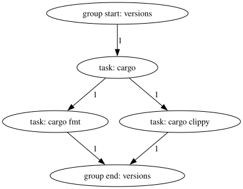

# `engage`

A task runner with DAG-based parallelism

---

## Features

* [X] Use any interpreter (typically, a shell such as `sh`)
* [X] Tasks can depend on other tasks (within the same group)
* [X] Groups can depend on other groups
* [X] Get an overview of tasks and groups by viewing them as a graph
* [X] Run a subset of the tasks and groups
  * [X] Run a single group (and its dependencies)
  * [X] Run a single task from that group (and its dependencies)
* [X] List available groups and tasks
* [X] Shell completions

## Introduction

A simple Engage file might look like this:

```toml
interpreter = ["bash", "-euo", "pipefail", "-c"]

[[task]]
name = "cargo"
group = "versions"
script = "cargo --version"

# There's no side effect that the following tasks depend on caused by the
# previous task, but this is just an example, and you wouldn't do this for real.

[[task]]
name = "cargo fmt"
group = "versions"
script = "cargo fmt --version"
depends = ["cargo"]

[[task]]
name = "cargo clippy"
group = "versions"
script = "cargo clippy --version"
depends = ["cargo"]
```

This creates a *group* called "versions"[^1] with three *tasks*: "cargo fmt"
and "cargo clippy", which depend on "cargo". This can be visualized by running
`engage self dot` and feeding the output to Graphviz:



When it's time to run a task, its script will be appended as a single element to
the `interpreter` list, which will then be executed.

When run with no arguments, Engage will execute the entire DAG, starting by
entering the "versions" group, running the "cargo" task's script first, then
the other two tasks' scripts *in parallel*, and finally exiting the group.

This implicit parallelism with explicit ordering when required allows Engage to
run your tasks as fast as possible, speeding up your workflows.

## Behavior

* All task scripts are executed with the working directory set to the location
  of the Engage file.

* Operations that require the Engage file can be invoked from the directory it's
  in or any of that directory's children.

* Group and task dependencies must form a directed acyclic graph. In other
  words, dependency cycles are not allowed.

* If a task fails, any subsequent tasks will not be executed and Engage will try
  to exit with the same value as the failed task.

* If no subcommand is supplied, all groups and tasks will be scheduled and
  executed based on their dependencies.

## Usage

* Run `engage help` to see the available commands and their descriptions.

* Run `engage self list` to see the available groups and tasks.

## Footnotes

[^1]: Nouns are preferred for group names to make the single-group invocation
  syntax grammatically correct.
