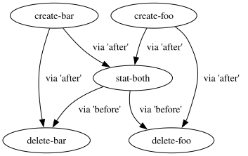

# Tutorial

This section demonstrates common features of Engage. After understanding this
section, the reference-style documentation (e.g. command line help text and
[Engage file format](file-format.md)) should be sufficient for learning the
other available features.

## Choosing the Engage file

By default, Engage will search for a file called `engage.toml` in the current
directory or all of its parent directories. Alternatively, a file can be
specified via a command line option. Henceforth, the phrase "Engage file" means
the file chosen by either of those strategies.

## Choosing an interpreter

An Engage file must, at minimum, define the interpreter that will be used to
execute the scripts. A common choice is to use the `bash` shell and to invoke it
like this:

```toml
{{#include assets/tutorial.toml:1}}
```

The `-c` option is necessary because Engage passes the value of each `script`
field to the interpreter as another argument at the end of the `interpreter`
list. The other options will make the script exit immediately if an error is
encountered, which is typically desirable in CI.

## Adding tasks

An Engage file is pointless without any tasks, so add some at the end of the
file from the above section like so:

```toml
{{#include assets/tutorial.toml:3:7}}
```

Each `[tasks.<name>]` table defines a task, where `<name>` is a placeholder for
the actual name of the task. `script` is the only required field for each task.

Task names are useful for identifying which part of the Engage file is producing
what output, visualizing the dependency graph, and selecting a subset of the
tasks to run at the command line. It's idiomatic for task names to be nouns that
don't contain characters that a shell would treat specially.

When Engage runs these tasks, the empty files `foo` and `bar` will be created
(or their atime and mtime will be updated if they already exist) in the same
directory as the Engage file, not in the working directory the `engage` command
was executed in (although these may be the same directory).

## Adding tasks with dependencies

Let's say we want to `stat` these two files, so we add a new task like this:

```toml
{{#include assets/tutorial.toml:9:10}}
```

This won't work reliably, however, as Engage runs tasks in parallel as much as
possible, so this command may run before the two files have been created. To fix
this, we can set `depends` for this new task like so:

```toml
{{#include assets/tutorial.toml:11}}
```

Perhaps we should also delete the files once we're done with them, so let's add
two more tasks:

```toml
{{#include assets/tutorial.toml:13:19}}
```

In this case depending on the `stat-both` task alone would be sufficient, but
we can additionally depend on the respective `create-foo` and `create-bar` tasks
so that ordering is less likely to be broken if the `stat-both` task is removed
in the future. Declaring "redundant" dependencies like this is permitted because
the resulting graph of of dependencies does not contain any cycles. However,
dependencies that *do* form a cycle are not permitted; `engage dot` can still
be used to visualize the graph for debugging, but Engage will refuse to run
any tasks.

## Putting it all together

Incorporating all the changes from the previous three sections results in this
complete Engage file:

```toml
{{#include assets/tutorial.toml}}
```

## Visualizing task dependencies

The `engage dot` subcommand can be used to convert an Engage file into [Graphviz
DOT Language][dot], which can then be processed by other tools. For example, it
can be used to produce a graph like this from the above Engage file:



This illustrates the order in which Engage will run each task, as well as what
tasks can be run in parallel with each other. In this example, `create-foo`
and `create-bar` will run in parallel, then `stat-both` will run by itself, and
finally `delete-foo` and `delete-bar` will run in parallel.

As mentioned earlier, this can also be useful for debugging dependency cycles,
or unexpected ordering between tasks in general.

[dot]: https://graphviz.org/doc/info/lang.html

## Running tasks

The `engage` command, when run with no subcommand, will execute all tasks in the
selected Engage file. While doing so, Engage will forward `stdout` and `stderr`
of the tasks, alongside an indication of which task is generating the output,
whether the output is coming from the task's `stdout` or `stderr` (marked with
an `O` or `E`, respectively), and some extra fluff to make it look pretty. At
the end, Engage will print out whether the run succeeded or failed and exit with
an appropriate status code:

| Status code | Meaning |
|-|-|
| `0` | All tasks exited successfully. |
| `1` | At least one task exited with an error status code. |
| `2` | Other errors, such as issues with the Engage file. |

Note that Engage's own `stdout` and `stderr` output is not considered stable.

It's also possible to use the `engage just` subcommand to run a subset of the
tasks in an Engage file.
