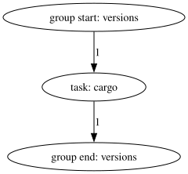

# The basics

By default, Engage will search for a file called `engage.toml` in the current
directory or all of its parent directories. This can also be overridden by
command line options. Henceforth, the phrase "Engage file" means the file chosen
by either of those strategies. Engage files are in the [TOML][toml] format.

[toml]: https://toml.io

## Choosing an interpreter

An Engage file must, at minimum, define the interpreter that will be used to
execute the scripts. A common choice is to use the `bash` shell and to invoke it
like this:

```toml
{{#include ../assets/0.toml:1}}
```

The `-c` option is necessary because Engage passes the value of each `script`
field to the interpreter as another argument at the end of the `interpreter`
list. The other options will make the script exit immediately if an error is
encountered, which is typically desirable in CI.

## Adding a task

An Engage file is pointless without any tasks, so add one at the end of the file
from the above section like so:

```toml
{{#include ../assets/0.toml}}
```

`name`, `group`, and `script` are the minimum required fields to define a task.

This task's name is `cargo` and it belongs to the `versions` group. Groups
don't need to be "explicity" defined, just mentioning one in a task like this is
enough to create it. Task and group names are useful for identifying which part
of the pipeline is producing what output, visualizing the DAG, and selecting
a subset of the DAG to run at the command line. It's idiomatic for task and
group names to be nouns that don't contain characters that a shell would treat
specially.

When Engage runs this task, it will run `cargo --version` as a command because
the interpreter is `bash`, causing the version of Cargo to be printed.

## Visualizing it

The `engage dot` subcommand can be used to convert an Engage file into [Graphviz
DOT Language][dot], which can then be processed by other tools. For example, a
graph like this can be produced:



This illustrates the order and parallelization with which Engage will execute
the DAG defined by the Engage file. In this case, there is only one group and
one task, so the graph is pretty simple.

[dot]: https://graphviz.org/doc/info/lang.html

## Running it

The `engage` command, when run with no subcommand, will execute the entire
DAG. While doing so, Engage will forward `stdout` and `stderr` of the tasks,
alongside an indication of which task is causing the output, whether the output
is coming from the task's `stdout` or `stderr` (marked with an `O` or `E`,
respectively), and some extra fluff to make it look pretty. At the end, Engage
will print out whether the run succeeded or failed and exit with an appropriate
status code:

| Status code | Meaning |
|-|-|
| `0` | All tasks exited successfully. |
| `1` | At least one task exited with an error status code. |
| `2` | Other errors, such as issues with the Engage file. |

Note that the `stdout` and `stderr` of Engage is not considered stable.
