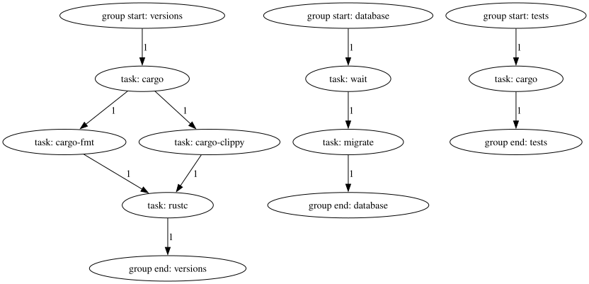
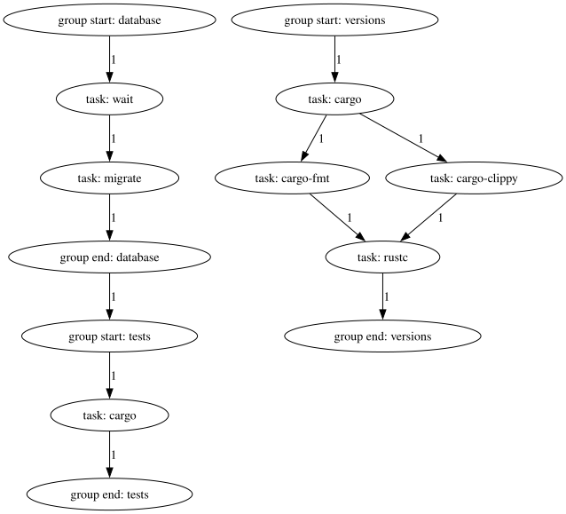

# Group dependencies

An Engage file with a handful of groups and tasks might look like this:

```toml
{{#include ../assets/3.toml}}
```

Which results in this graph:



This will correctly wait for the database to become ready before running the
migrations, but it will also start the test suite before either of those have
finished! This can be fixed by using group dependencies like so:

```toml
{{#include ../assets/4.toml}}
```

Which results in this graph:



Here, it can be seen that the `database` group must finish before the `tests`
group can start.

Groups encapsulate multiple tasks into a single unit, and group dependencies
allow depending upon those units as a whole. This makes it easy to reuse groups
of tasks with their intended ordering by depending on the entire group. Without
these features, reuse of mulitple tasks becomes difficult as one must recall
which tasks belong to the "group" each time that "group" needs to be depended
upon, which is error-prone.
