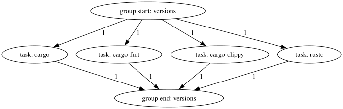
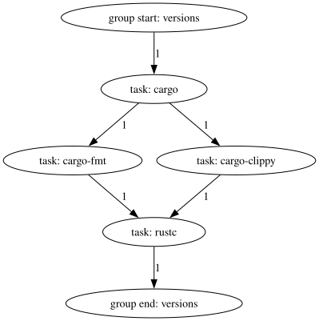

# Task dependencies

An Engage file with a handful of tasks (but only one group) might look like
this:

```toml
{{#include ../assets/1.toml}}
```

Which results in this graph:



In this configuration, Engage will run all four tasks at the same time. This is
actually ideal for this example, since none of these tasks require side effects
from any of the other tasks to happen first.

For the sake of demonstrating how Engage works though, pretend that `cargo-fmt`
and `cargo-clippy` must be run after `cargo`, and `rustc` can only run after
`cargo-fmt` and `cargo-clippy` have finished. This can be accomplished by making
the following changes:

```toml
{{#include ../assets/2.toml}}
```

Which results in this graph:



Here, it can be seen that Engage will first run `cargo`, and when it's done,
it will run `cargo-fmt` and `cargo-clippy` in parallel, and after those both
finish, it will finally run `rustc`.

If a task with dependents fails, Engage will not start any of those dependent
tasks. In the above Engage file, if `cargo-fmt` or `cargo-clippy` fail, then
`rustc` is guaranteed to not run; if `cargo` fails, then all three other tasks
are guaranteed to not run.
